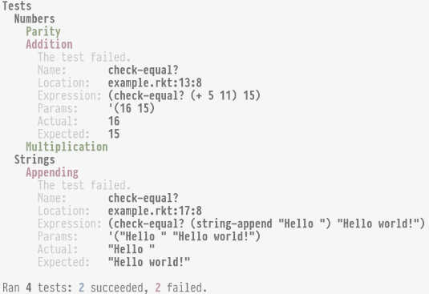

# `rackunit-fancy-runner`

This package contains a way to run RackUnit test suites in the command lines
that has a fancier output format than the built-in `rackunit/text-ui`.

In particular, it uses color and displays nested test suites as a tree. Errors
are displayed in line.

It looks like this:



## How to use

The module provides a procedure called `run-tests/fancy`. To run the tests,
simply call this procedure with a RackUnit test suite.

For example, this file will show the output above:

```racket
#lang racket

(require rackunit
         rackunit-fancy-runner)

(provide tests)

(define tests
  (test-suite "Tests"
    (test-suite "Numbers"
      (test-pred "Parity" even? 4)
      (test-case "Addition"
        (check-equal? (+ 5 11) 15))  ; Oops
      (test-equal? "Multiplication" (* 3 2) 6))
    (test-suite "Strings"
      (test-case "Appending"
        (check-equal? (string-append "Hello ") "Hello world!")))))  ; Oops

(run-tests/fancy tests)
```

**Tip:** For larger projects, I find that Racket is often slow to start up, which
can make it a pain to run and rerun unit tests. You can use the `,enter`
command in the REPL to speed up this process. For example, with the above file
saved as `tests.rkt`, try running the following:

```
$ racket
> ,enter tests.rkt
<pkgs>/my-package/tests> (run-tests/fancy tests)
...
```

Then, to run the tests again after having updated the code or tests, just do:

```
<pkgs>/my-package/tests> ,enter tests.rkt
<pkgs>/my-package/tests> (run-tests/fancy tests)
   [re-loading ...
```

This is much faster than restarting the REPL.


